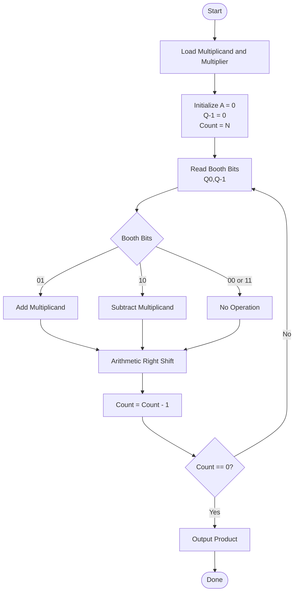
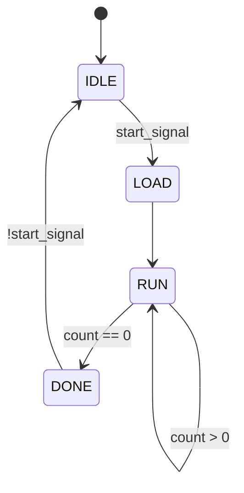
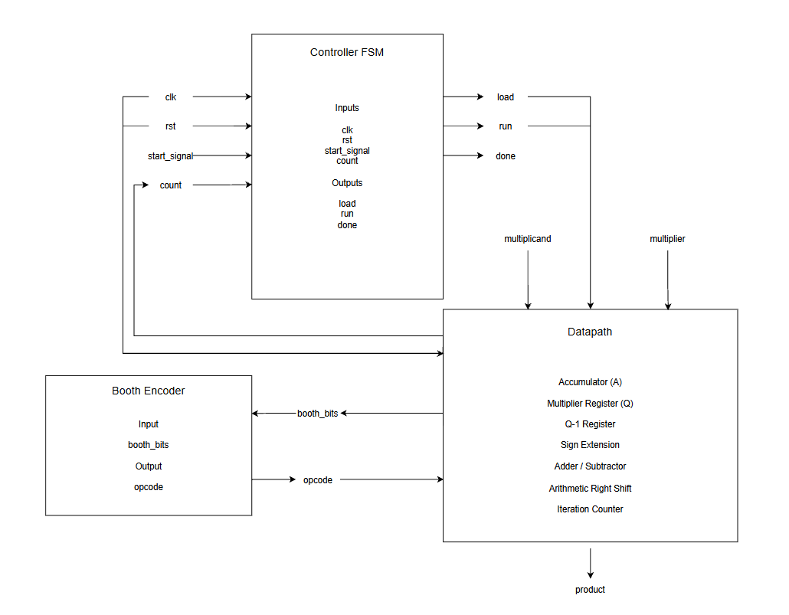
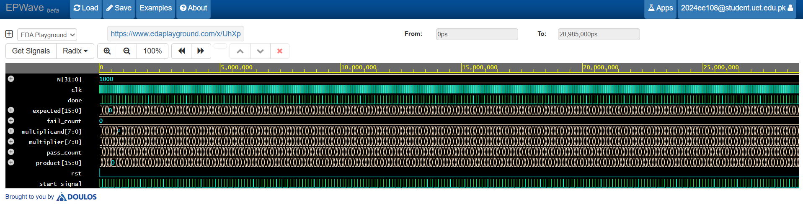
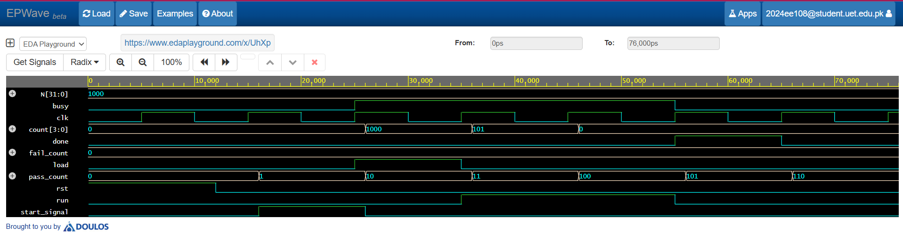
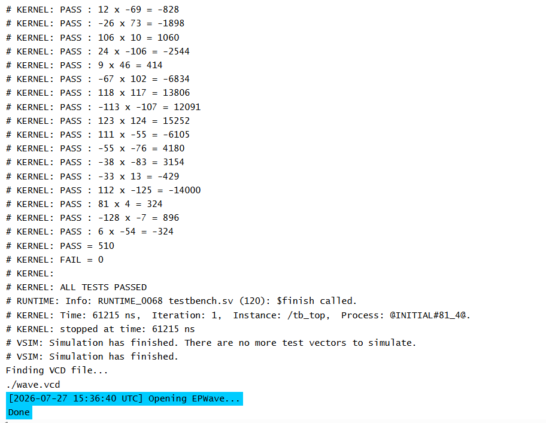
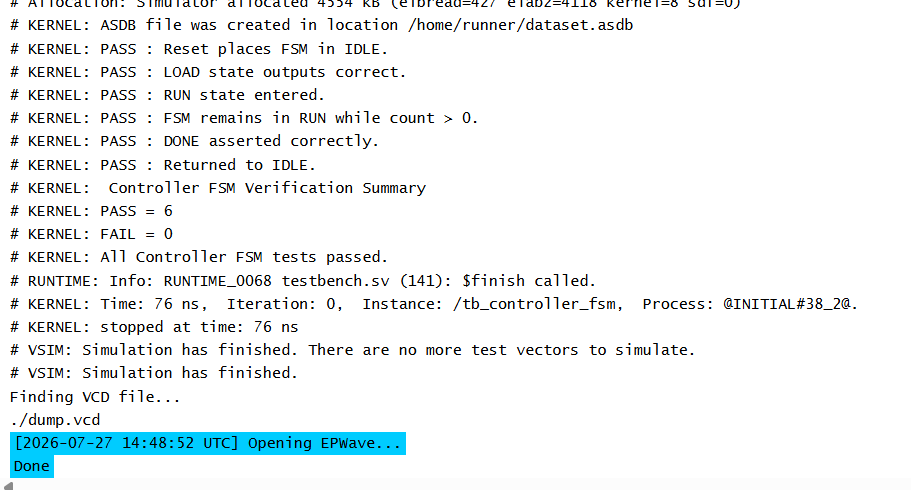

# **SYSTEMVERILOG FOR DIGITAL DESIGN**
## *MEDS Training Programme*
### **Module 4 Assesment**
### *8-bit Signed Radix-2 Booth Multiplier*

**Project Description:** 
Multiplication is one of the most fundamental arithmetic operations in digital systems and is extensively used in processors, digital signal processing (DSP), communication systems, image processing, and embedded applications. Conventional binary multiplication methods require a large number of partial products, increasing hardware complexity, delay, and power consumption.

To improve efficiency, optimized multiplication algorithms such as Booth multiplication are commonly used. The Radix-2 Booth algorithm reduces unnecessary arithmetic operations by examining the multiplier bits and identifying consecutive sequences of ones. This minimizes the number of addition and subtraction operations while naturally supporting signed two's complement multiplication.

This project focuses on the design and implementation of an 8-bit signed sequential multiplier using the Radix-2 Booth algorithm in SystemVerilog. The design follows a modular architecture consisting of a datapath, a finite state machine (FSM) controller and a Booth encoder. The design is verified using self-checking SystemVerilog testbenches with both directed and randomized test cases.

**Objectives:** 
The main objectives of this project are:
- Design an 8-bit signed Radix-2 Booth multiplier in SystemVerilog.
- Implement the multiplier using a sequential hardware architecture.
- Design separate datapath and control units.
- Implement an FSM-based controller for managing multiplication operations.
- Perform one Booth iteration per clock cycle.
- Verify the design using self-checking SystemVerilog testbenches.
- Validate the design using directed, corner-case and randomized verification.

**Motivation:** 
Hardware multipliers play a very important role in modern computing systems. The Radix-2 Booth algorithm is a widely used signed multiplication technique because it:
- Naturally supports two's complement signed multiplication without requiring additional correction circuitry.
- Reduces unnecessary arithmetic operations by encoding consecutive runs of ones.
- Provides an efficient sequential implementation requiring minimal hardware resources.
- Produces a fully synthesizable hardware design suitable for FPGA and ASIC implementation.

**Methodology:** 
The proposed system uses a sequential Booth multiplication architecture divided into three major sections:
- Datapath
- Controller FSM
- Booth Encoder

**Booth Algorithm:** 
The Radix-2 Booth algorithm examines the multiplier bits in overlapping groups of two:
~~~
(Q0, Q-1)
~~~

The arithmetic operation is selected according to the following encoding:

| Booth Bits |       Operation       |
|:----------:|:---------------------:|
|     00     |      No Operation     |
|     01     |    Add Multiplicand   |
|     10     | Subtract Multiplicand |
|     11     |      No Operation     |

After the selected arithmetic operation, the combined register undergoes an arithmetic right shift by one bit.
~~~
{A, Q, Q-1} >>> 1
~~~

Since one multiplier bit is processed during each iteration, the multiplication completes after N clock cycles.

**Booth Algorithm Flowchart:** 
## Booth Multiplication Algorithm

**FSM State Diagram:** 

**Schematic:**

**RTL Modules:** 
The project consists of the following RTL modules:
- controller_fsm.sv
- datapath.sv
- booth_encoder.sv
- radix2_booth_multiplier.sv

**Verification Strategy:** 
The design is verified using self-checking SystemVerilog testbenches.
The verification process includes:
- Directed test cases
- Corner-case testing
- Randomized testing
- Automatic PASS/FAIL checking using the built-in signed multiplication operator as the reference model

The expected product is calculated using:
~~~
expected = $signed(a) * $signed(b); //where a = multiplicand & b = multiplier
~~~

**Installation:**

Follow these instructions inside bash:

1. Clone the repository:
    ~~~
    git clone https://github.com/<your-username>/Radix-2-booth-multiplier.git
    cd Radix-2-booth-multiplier
    ~~~

**Project Structure:** 
~~~
project/
│
├── rtl/
│   ├── controller_fsm.sv
│   ├── datapath.sv
│   ├── booth_encoder.sv
│   └── radix2_booth_multiplier.sv
│
├── tb/
│   ├── tb_controller_fsm.sv
│   └── tb_radix2_booth_multiplier.sv
│
└── README.md
~~~

**Functional Coverage:** 
The verification environment includes functional coverage to ensure that all major operating scenarios of the Booth multiplier are exercised.

Coverage includes:
- Positive × Positive multiplication
- Positive × Negative multiplication
- Negative × Negative multiplication
- Zero multiplication
- Boundary values (127 and -128)
- Randomized signed operand combinations
- All Booth encoding combinations (00, 01, 10, 11)

Coverage Results
|    Coverage Item   | Status |
|:------------------:|:------:|
|    Booth Encoder   |  100%  |
|   Directed Tests   |  PASS  |
|    Corner Cases    |  PASS  |
| Random Tests (500) |  PASS  |

**Waveforms:**

>Top module

>Controller FSM

**Terminal:**

>Top module

>Controller FSM

Author: 
***Noor Fatima***